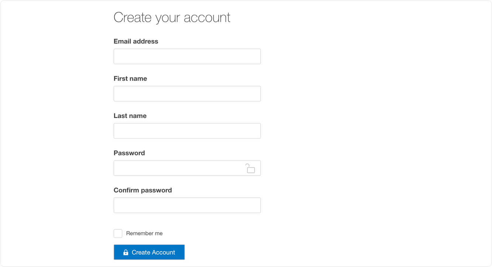
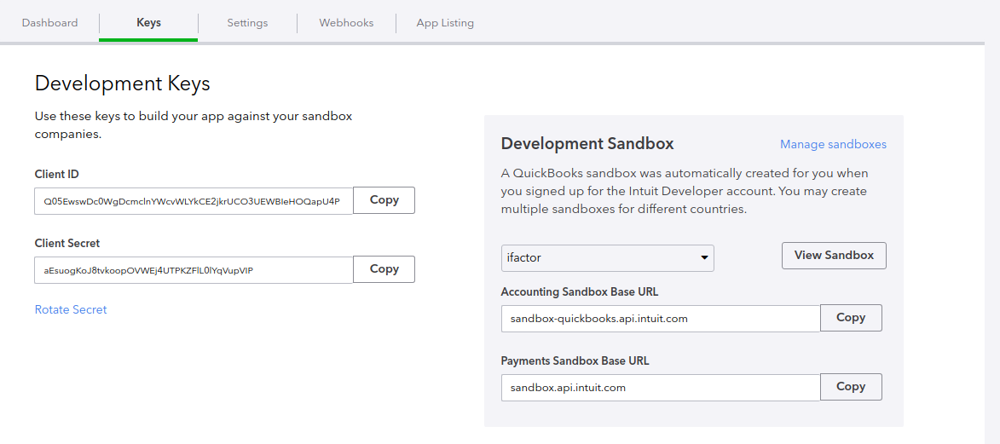
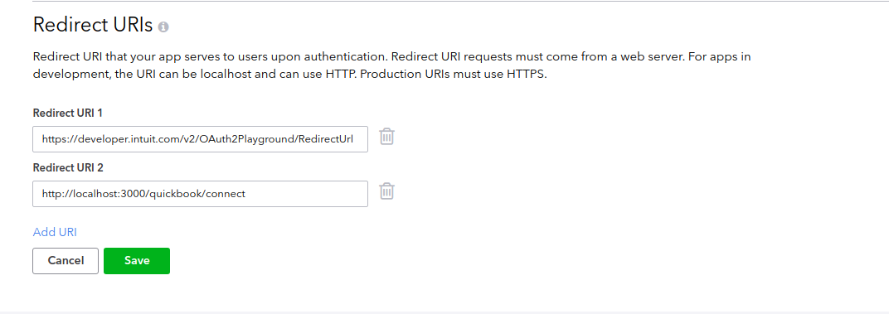
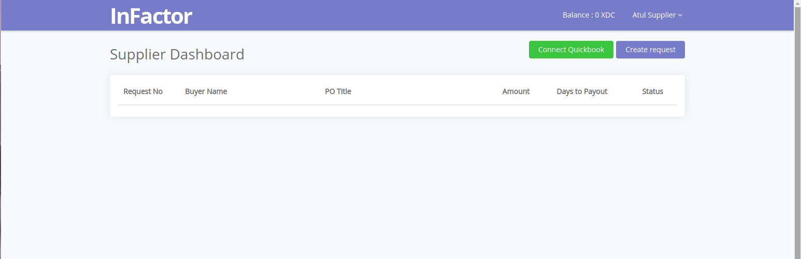
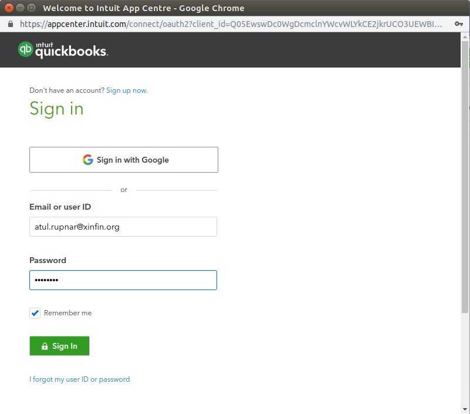
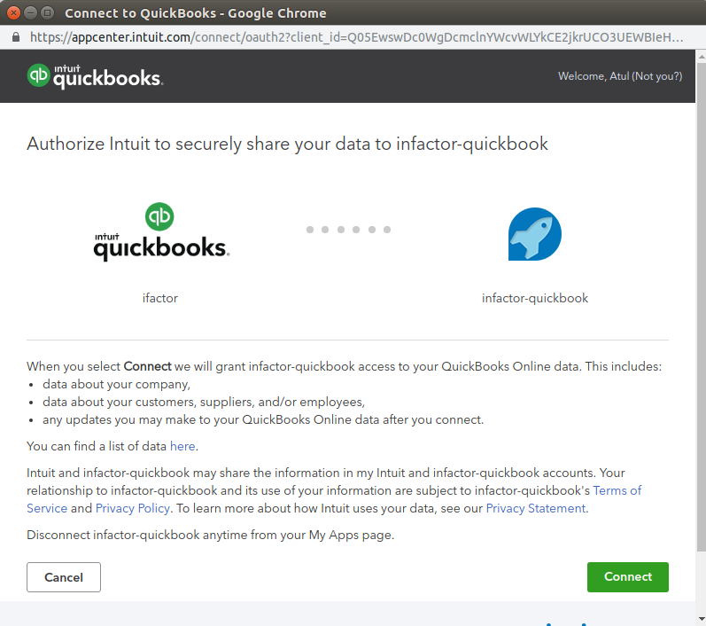
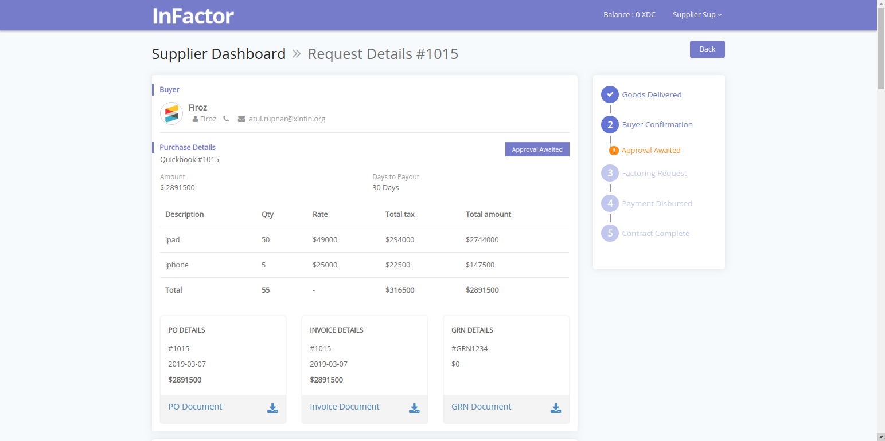

**prerequisite**

 - Complete the set up of infactor.io on your local machine.(Clone the git repo from quickbook branch)

**1. Create an Intuit Developer account**

[Sign up](https://developer.intuit.com/v2/ui#/signup) for a new Intuit Developer account

    

**2. Create an app**

a. Select My apps and then Create an app

    

b. Select the Keys tab to locate your Client ID and Client Secret

    

c. Add the redirect Url

Note : redirect url be exactly, http://localhost:3000/quickbook/connect

    

**3. Add app configurations**

- Copy content from example.env file to a new file .env in a project root directory

- Add the configuration details according to your project details as in step 2

**4. Add invoices to your app on quikbook**

**5. Start infactor application on your localhost**

- start application 

		npm start

- create a supplier user and go to dashboard

    

**6. Sync Invoices with QuickBooks**

a. Click on connect QuickBooks to sync QuickBooks invoices. It will open a new popup window to give authorisation. Add your QuickBooks login details.

    

b. Authorise infactor to access your company data(invoices) by clicking on connect button. close the popup window on response.

    

**7. refresh the dashboard, all new invoices will appear on dashboard.**

    

**8. Click on any invoice see the complete details**

    

## Invoice Mapping

| Name | QuickBooks Field | Infactor Field | Description |
| ---- | --------------- | -------------- | ----------- |
| Invoice Number | DocNumber | invoiceNo | Unique Invoice Number |
| Invoice Amount | TotalAmt | invoiceAmount | Total Invoice Amount |
| Invoice Date | MetaData.CreateTime | invoiceDate | Invoice created date |
| Payable Date | DueDate | payableDate | Invoice Payable Date |
| Tax Amount | TxnTaxDetail.TotalTax | taxAmount | Total tax amount |
| Invoice Items | Line | items | Invoice Description (Item wise) |
| Tax Details | TxnTaxDetail | taxDetails | Tax details(Invoice wise) |
| CompanyName | CustomerRef.name | companyName | Buyers company name |
| Buyers Email | BillEmail.Address or **\*** primaryAddress.address | buyerEmail | Buyers Email |
| Contact Name | CustomerRef.name | contactName | Buyer Contact Name |
| Company Email | BillEmail.Address | companyEmail | Company Email |
| Purchase Date | MetaData.CreateTime | purchaseDate | Purchase order date |
| Invoice State | **\*\*** "invoice_created" | state | Status of the invoice |
| QuickBooks reference | Id | qbkInvoiceId | Invoice reference for QuickBooks |
| Source | **\*\*** "QuickBooks" | source | source of invoice (ERP system identifier) |

**\*** Field belongs Customer assosiated with Invoice

**\*\*** No QuickBooks fields are present, Instead default values are set to Infactor invoice

**Troubleshooting**

Public discussions on the technical issues. Please Join Below mention Public Chat or Group. 

[Slack Public Chat](https://launchpass.com/xinfin-public), 

[Telegram Chat](http://bit.do/Telegram-XinFinDev), 

[Forum](https://xinfin.net)

